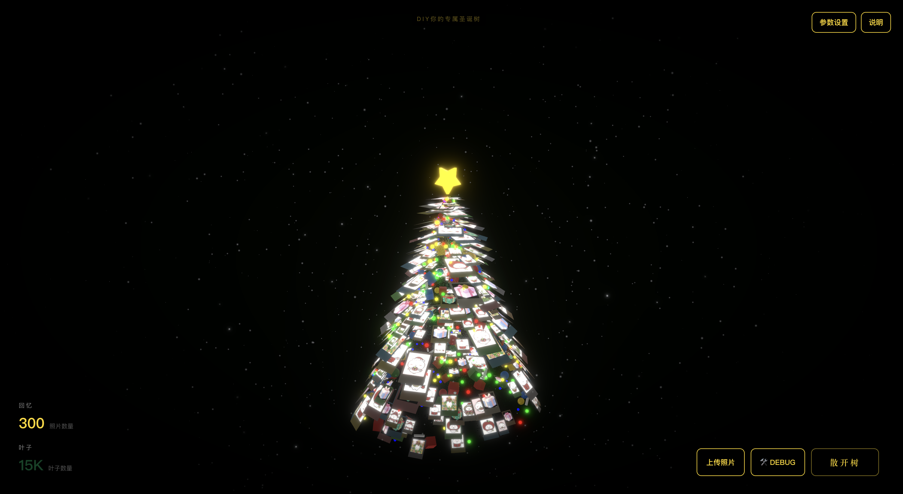
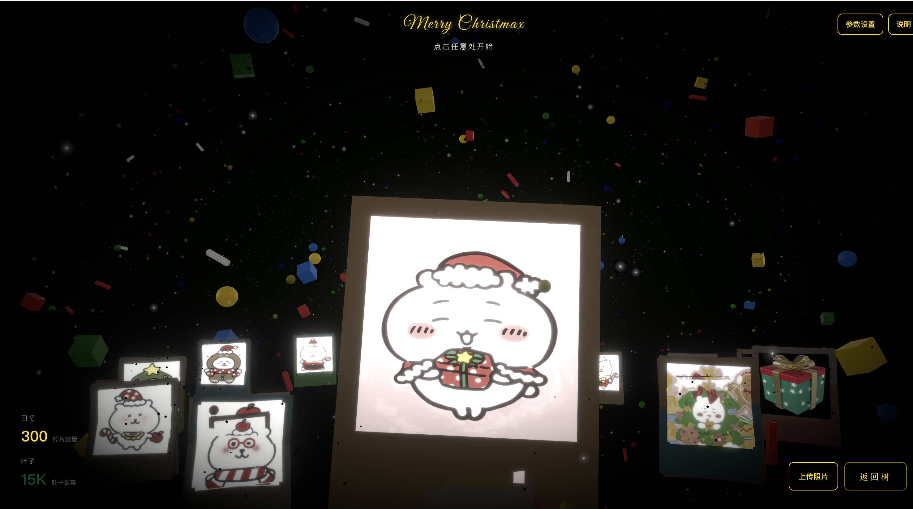

# 3D 互动圣诞树 🎄

一个基于 React + Vite 的交互式 3D 圣诞树 Web 应用，支持点击屏幕在“聚合/散开/照片墙(GALLERY)”三态间循环切换，并结合个性化照片，打造专属节日体验。




## ✨ 特性

- **沉浸式 3D 场景**: 使用 React Three Fiber (Three.js) 渲染高保真场景，包含树叶粒子、双面拍立得、闪烁彩灯、圣诞装饰物与顶部金色五角星。
- **交互控制）**: 点击屏幕任意处按顺序在“聚合 → 散开 → 照片墙 (GALLERY) → …”三态间循环切换。
- **照片墙场景**:
  - 星空背景与金属圣诞球点缀，顶部金色发光手写体“Merry Christmas”。
  - 3D 环形照片轮播（拍立得风格），支持拖拽与点击居中。
- **个性化照片墙**:
    - **自动扫描**: 启动时自动扫描 `src/assets/photos/` 目录下的图片 (支持 `.jpg`, `.jpeg`, `.png`, `.webp`)。
    - **动态上传**: 通过页面右下角“上传照片”按钮，可多选上传图片即时生成专属圣诞树。上传后仅使用本次上传的照片。
    - **顶部图片**: 文件名为 `top.*` (如 `top.jpg`) 的图片会被优先显示在顶部。
- **实时参数调节**: 通过右上角“参数设置”面板，可动态调整树叶粒子、照片挂件、圣诞元素与彩灯的数量，更改实时生效。

## 🛠 技术栈

- **前端框架**: React 18, Vite
- **3D 渲染**: React Three Fiber (Three.js)
- **3D 工具库**: `@react-three/drei`, `@react-three/postprocessing`
- **数学/粒子**: `maath`

## ⚙️ 环境要求

- **Node.js**: ≥ 18 (推荐 18 或 20)
- **包管理器**: npm
- **浏览器**: 支持 WebGL / WebAssembly (Chrome, Edge, Firefox, Safari 等)

## 🚀 快速开始

1.  **克隆项目并安装依赖**
    ```bash
    npm install
    ```

2.  **启动开发服务器**
    ```bash
    npm run dev
    ```

## 📖 使用说明

### 交互控制
- 点击屏幕任意位置：在 `Assemble（聚合） → Disperse（散开） → Gallery（照片墙） → …` 三种状态间循环切换。
- 点击右下角“照片墙”按钮：直接进入 `GALLERY`；在该场景中点击“返回树”按钮回到树形态。

### 照片墙 (GALLERY)
- 背景：深色星空、闪烁粒子、金属圣诞球。
- 标题：顶部“Merry Christmas”金色发光手写体。
- 轮播：
  - 中央为当前选中照片，最大且最清晰；两侧逐渐变小/变暗。
  - 鼠标拖拽环形区域可旋转轮播；点击任意非中心照片会自动旋转使其居中。
  - 使用 `src/assets/photos/` 目录中的图片（支持 jpg/jpeg/png/webp），会优先使用文件名为 `top.*` 的图片。

### 参数设置（右上角）
- 照片墙参数：
  - 照片数量：控制环形中使用的照片总数。
  - 照片大小（缩放）：控制单张拍立得卡片的整体尺寸。
  - 环形半径（密度）：控制环形的半径，半径越小，密度越高。

### 上传照片
点击页面右下角的 **“上传照片”** 按钮，从本地或手机相册中多选图片 (支持 `.jpg`, `.jpeg`, `.png`, `.webp`)。上传成功后，圣诞树将仅使用本次上传的照片进行渲染。

### 参数面板 (右上角“参数设置”)
- **树叶粒子数量**: 控制树身的粒子密度。数值越大越华丽，但对性能要求越高。
- **拍立得照片数量**: 设置照片挂件的数量。当照片数量不足时，纹理会循环使用。
- **圣诞元素数量**: 设置礼物盒、彩球、拐杖糖等装饰物的总数。
- **彩灯数量**: 设置闪烁的圣诞灯泡数量。


### 自定义启动照片
将你的图片放入 `src/assets/photos/` 目录下，应用启动时会自动扫描并加载。

## 📄 许可证

本项目基于 [MIT License](LICENSE) 开源。

**致谢**: 本项目在 [moleculemmeng020425/christmas-tree](https://github.com/moleculemmeng020425/christmas-tree) 的基础上进行修改与扩展。

---

## 🎅 圣诞快乐！ 🎄✨
